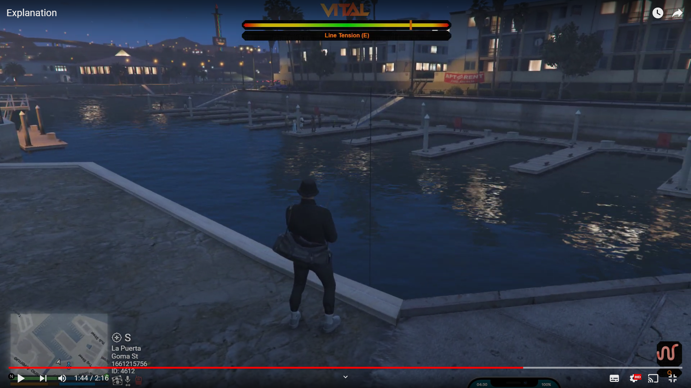
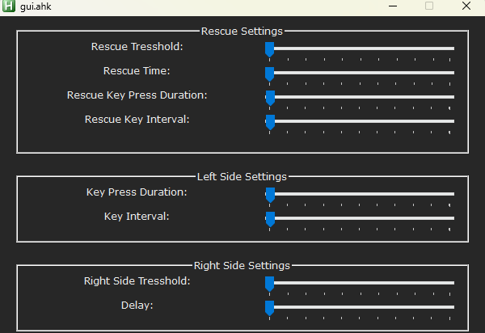

# fivem-fishing-minigame-bot-ahk

> An intelligent AutoHotkey v1.1 bot that automates the fishing minigame in GTA V FiveM servers.


---



## ✨ Features

- **🤖 Fully Automated** — Handles the entire fishing minigame from casting to catching
- **🎯 Smart Detection** — Pixel-perfect detection of the orange bar and needle using color scanning
- **⚡ Adaptive Response** — Dynamic key pressing based on needle position (rescue mode, normal mode, delay mode)
- **🎛️ GUI Configuration** — Easy-to-use settings window with live sliders
- **🔧 Customizable Parameters** — Fine-tune every aspect of the bot behavior
- **🐛 Debug Mode** — Visual overlay showing detection regions (Ctrl+F12)
- **💾 Persistent Settings** — Automatically saves your configuration to `settings.ini`

---

## 📋 Requirements

- **AutoHotkey v1.1** ([Download here](https://www.autohotkey.com/download/ahk-install.exe))
- **GTA V FiveM** with fishing minigame support
- **Windowed or Borderless Window** mode (required for pixel detection)
- **1920x1080 resolution** (or adjust region coordinates in source)

---

## 🚀 Installation

1. **Download** the latest release or clone this repository:
   ```bash
   git clone https://github.com/thinkRand/fivem-fishing-minigame-bot-ahk.git
   ```

2. **Ensure you have AutoHotkey v1.1 installed**

3. **Run `GTA5 - Auto fishing - v1.3`** (main script file)

4. **The bot will auto-generate `settings.ini`** on first run with default values

---

## 🎮 Usage

### Quick Start

| Hotkey | Action |
|--------|--------|
| `F10` | **Toggle Bot ON/OFF** — Start or stop the fishing automation |
| `Ctrl + F12` | **Toggle Debug Mode** — Show/hide detection region overlays |
| `2` | **Test Detection** — Manually check if the orange bar is detected |

### How It Works

1. **Press F10** to activate the bot
2. The bot automatically:
   - Detects when the fishing minigame starts (orange bar appears)
   - Tracks the needle position in real-time
   - Presses `E` with precise timing to keep the fish in the green zone
   - Detects successful catches and recasts automatically
3. **Press F10 again** to stop the bot

---

## ⚙️ Configuration

Open the GUI by running the script and use the settings window to customize:



### 🆘 Rescue Settings (Left Side - Critical Zone)
| Setting | Description | Default |
|---------|-------------|---------|
| **Rescue Threshold** | % of bar where emergency rescue begins | 56% |
| **Rescue Time** | Duration of emergency key spam (ms) | 252ms |
| **Rescue Key Press Duration** | How long to hold E during rescue | 120ms |
| **Rescue Key Interval** | Delay between rescue presses | 80ms |

### ⬅️ Left Side Settings (Normal Reeling)
| Setting | Description | Default |
|---------|-------------|---------|
| **Key Press Duration** | How long to hold E normally | 54ms |
| **Key Interval** | Delay between normal presses | 102ms |

### ➡️ Right Side Settings (Delay/Relax Zone)
| Setting | Description | Default |
|---------|-------------|---------|
| **Right Side Threshold** | % of bar where delay mode activates | 64% |
| **Delay** | Cooldown time before resuming reeling | 228ms |

### 🎣 Fishing Delay Settings (in settings.ini)
```ini
[fishingDelay]
fishingMinInterval=3000    ; Minimum time before recast (ms)
fishingMaxInterval=5000    ; Maximum time before recast (ms)
```

---

## 🔧 Advanced: Region Configuration

The bot uses pixel detection in specific screen regions. If your resolution differs from 1920x1080, edit these coordinates in the source:

```autohotkey
; Main detection regions (default for 1080p)
regionBarraNaranja := crearRegion(675, 54, 1243, 66)   ; Orange bar detection
regionBarra        := crearRegion(675, 66, 1243, 74)   ; Full bar area
regionZonaBaja     := crearRegion(675, 66, 867, 74)    ; Left zone (green)
regionZonaMedio    := crearRegion(868, 66, 1047, 74)   ; Middle zone
regionZonaAlta     := crearRegion(1048, 66, 1243, 74)  ; Right zone (red)
```

**Color Detection Values:**
- Orange Bar: `0x0312FD` (Blue channel dominant in BGR)
- Green Zone: `0x04FA0D`
- Blue Zone: `0x01E5FC`
- Needle: `0x1593D0`

---

## 🛠️ Troubleshooting

| Issue | Solution |
|-------|----------|
| Bot doesn't detect the minigame | Ensure game is in **Windowed/Borderless** mode. Run debug mode (Ctrl+F12) to check regions |
| Needle detection is erratic | Adjust `regionBarraNaranja` coordinates to match your UI scale |
| Fish escapes too often | Lower **Rescue Threshold** and increase **Rescue Time** |
| Bot is too slow to react | Decrease **Key Interval** values, increase **Key Press Duration** |
| Settings not saving | Run as Administrator or check file permissions on `settings.ini` |
| Wrong colors detected | Use AutoHotkey Window Spy to verify pixel colors at detection points |

## ⚠️ Disclaimer

> **This tool is for educational purposes only.**  
> Use at your own risk. Some FiveM servers may consider automation tools as violations of their Terms of Service. The developers assume no liability for any bans or penalties incurred from using this software. Always check server rules before using.
